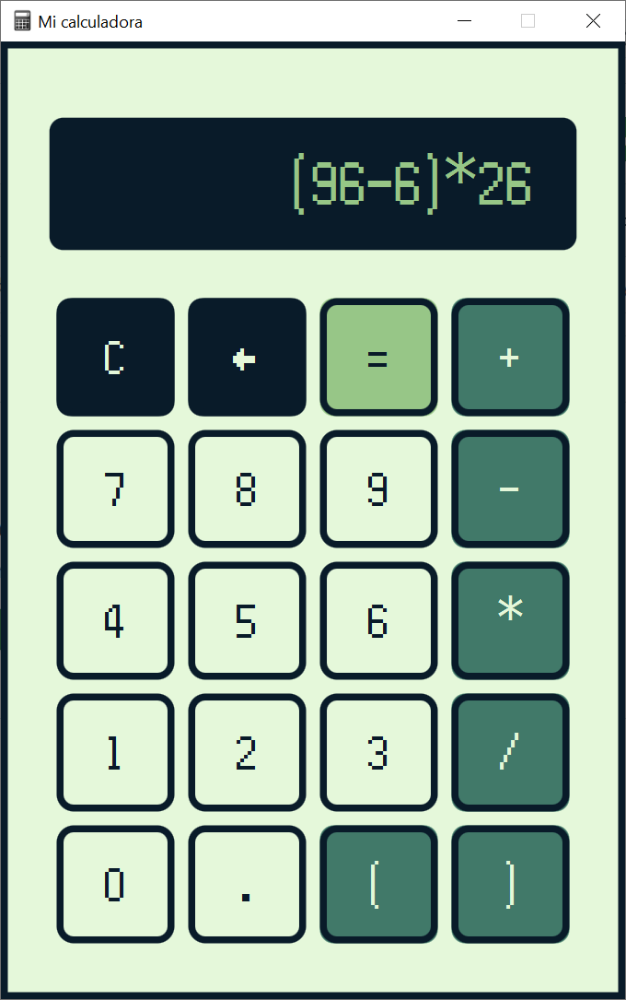

<!--  -->

  

# <b>ES</b> CALCULADORA JAVA

## Descripción
Tarea estudiantil que consistió en usar Java y JavaFX para crear una aplicación de calculadora con interfaz de usuario.
Realiza operaciones básicas de suma, resta, multiplicación y división, aceptando decimales y paréntesis.
Además debía cumplir algunas normas para evitar errores o lanzar un mensaje de error en situaciones específicas.

## Tecnologías utilizadas
- JDK 17
- JavaFX
- NetBeans

## Cómo ejecutar
1. Abrir la carpeta del proyecto desde el IDE que se prefiera
2. Añadir de nuevo la librería exp4j al proyecto
3. Ejecutar el programa desde el IDE

## Autor
- staluap / Paula Serrano Torrecillas
- Estudiante FP DAW

  

# <b>EN</b> JAVA CALCULATOR

Student project using Java and JavaFX to create a calculator application with a user interface.
Performs basic operations: addition, subtraction, multiplication, and division, supporting decimals and parentheses.
Additionally, it follows certain rules to prevent errors or display an error message in specific situations.

## Technologies used
- JDK 17
- JavaFX
- NetBeans

## How to run
1. Open the project folder in your preferred IDE
2. Add the exp4j library to the project again
3. Run the program from the IDE

## Author
- staluap / Paula Serrano Torrecillas
- Associate Degree in Web Application Development Student

